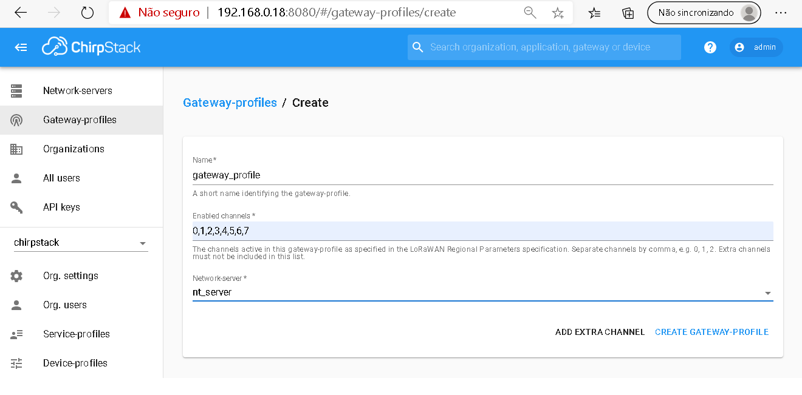

# NetSoft2020-Tutorial4-Demo3-Exp1

## Expected result
This experiment aims to demonstrate a RAN based on LTE technology with integrated with a LoRa wireless network implemented in hardware (non-3GPP Network). For RAN LTE, we use open-source software and an SDR. We also use an open-source implementation of the SBA-based 5G core software, as illustrated by the following image.
<p align="center">
     
</p>

 ## Installation

**Requirements**

The minimum hardware requirement and software to run this experiment is shown in the image below.
* Sensor LoRa
* Mini Gateway LoRa
* Smartphone Android
* SIM card (writable)
* USRP B210
* Mini PC (RAM: 4GB and disk space: 40GB)
* Ubuntu 16.04 LTS
* Docker 18.09.7
* srsLTE release 19_12
* free5GC stage 1
* ChirpStack 

**Steps**

We need two tools to run this experiment, _Git_ and _Docker_

To install _Git_, run the following command:
```
sudo apt-get install git-all
```

To install _Docker_, run the following commands:
```
sudo apt-get update
sudo apt-get install docker-ce docker-ce-cli containerd.io
```

 After, we can clone the **NetSoft2020-Tutorial4-Demo3-Exp1 project**:
```
git clone https://github.com/LABORA-INF-UFG/NetSoft2020-Tutorial4-Demo3-Exp1.git
```

To build the eNB and all 5GC images, use the following command:  
```
sudo docker build -t netsoft2020tutorial4demo3exp1 .
```

To run the containers, use the following command:
```
sudo docker-compose up -d
```

To build the LoRaWAN imagens, we use a Virtal Machine in the cloud and the following the commands:
```
git clone https://github.com/LABORA-INF-UFG/NetSoft2020-Tutorial4-Demo3-Exp1.git
```

```
cd  NetSoft2020-Tutorial4-Demo3-Exp1/LoRaWAN
```

```
sudo docker-compose up -d
```
<p align="center">
     
</p>

Done! The software is successfully installed.

## Tests

We can check if the images are up:
```
sudo docker image ls
```

The output should be similar to the following:
<p align="center">
     
</p>

We can check if the containers are up:
```
sudo docker-compose ps
```

The output should be similar to the following:
<p align="center">
     
</p>

The first step of the experiment is to store in HSS the UE's information using the Web Interface of the [free5GC](https://www.free5gc.org/) project that is available at http://localhost:3000, as is shown in the image below.
<p align="center">
     
     
</p>

We can see the smartphone connected in the network called free5GC available. 
<p align="center">
     
</p>

We use the [PingTools Network Utilities](https://play.google.com/store/apps/details?id=ua.com.streamsoft.pingtools&hl=pt_BR) tool available at GooglePlay to test the connectivity of the network.
<p align="center">
     
     
</p>


We connect the smartphone to the gateway via USB. This smartphone is placed in USB Tethering mode to make the connection via the cellular network.
<p align="center">
     
     
</p>

**Setting  LoRaWAN® Network**

We need to configure the network through the Web interface at http://IP:8080.
<p align="center">
     
</p>

To connect the ChirpStack Application Server instance with the ChirpStack Network Server instance, click Network servers and after click in Add.
<p align="center">
     
</p>

To create a service profile.
<p align="center">
     
</p>

To add the gateway ID that will be managed, after adding the Service Profile.
<p align="center">
     
</p>

To configure the Gateway Profile.
<p align="center">
     
</p>

The LoRaWAN gateway must be functional if the following information appears.
<p align="center">
     
</p>

To configure the sensors that we want to monitor, add a profile for the device.
<p align="center">
     
</p>

The device must be associated with an application, so we must create it.
<p align="center">
     
</p>


We can add the device to the application. 
<p align="center">
     
</p>

<p align="center">
     
</p>


Finally, we have the network configured.
<p align="center">
     
</p>

We can see the data received from the sensor in the application.
<p align="center">
     
</p>


## Additional comments

Two steps are needed when adding a gateway LoRa. 

1. To configure the gateway that it sends data to the ChirpStack Gateway Bridge component. In the packet-forwarder configuration, modify the following configuration keys:
```
server_address to the IP address / hostname of the ChirpStack Gateway Bridge
serv_port_up to 1700 (the default port that ChirpStack Gateway Bridge is using)
serv_port_down to 1700 (same)
```
2. To add the LoRa gateway to the ChirpStack Server network. For this, access the ChirpStack Application Server web-interface and add the gateway to your organization. In case your gateway does not have a GPS, you can set the location manually.

LoRaWAN network components were provided by the [chirpstack](https://www.chirpstack.io/) project.

The SIM card used is of [sysmocom](https://www.sysmocom.de/index.html) with an Android Samsung Galaxy S7 SM-G930F.

SDR is an [Ettus B210](https://www.ettus.com/) with four antennas connected via USB in the mini PC.  

RAN is deployed with the [Software Radio Systems LTE](https://github.com/srsLTE/srsLTE) project.

The Core is implemented using the [free5GC](https://www.free5gc.org/) project.
